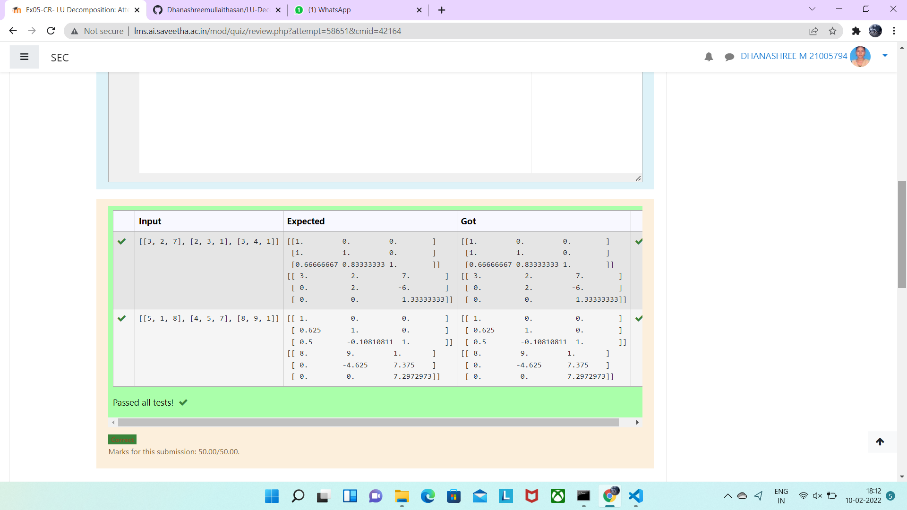

# LU Decomposition 

## AIM:
To write a program to find the LU Decomposition of a matrix.

## Equipments Required:
1. Hardware – PCs
2. Anaconda – Python 3.7 Installation / Moodle-Code Runner

## Algorithm
1. calculate the element of L and U
2. Print element of L and U
3. find vby solving LV=b by forward substitution
4.find x by solving UX=v by backward substitution 
5. print array X as the solution

## Program:
(i) To find the L and U matrix


```
*/
Program to find the L and U matrix.
Developed by: Dhanashree M
RegisterNumber: 21005794
# To print L and U matrix
import numpy as np
from scipy.linalg import lu
A=eval(input())
P,L,U=lu(A)
print(L)
print(U) 
*/

```
(ii) To find the LU Decomposition of a matrix
```
/*
Program to find the LU Decomposition of a matrix.
Developed by: Dhanashree M
RegisterNumber: 21005794
# To print X matrix (solution to the equations)
import numpy as np
from scipy.linalg import lu_factor,lu_solve
A =eval(input())
B =eval(input())
lu,piv= lu_factor(A)
x= lu_solve((lu,piv),B)
print(x)
*/
```

## Output:



## Result:
Thus the program to find the LU Decomposition of a matrix is written and verified using python programming.

